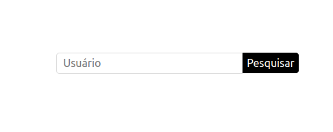
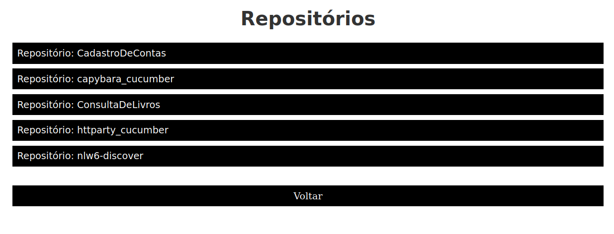

<h1 align="center">
   Consulta repositórios no gitHub
</h1>

<p align="center">
  <a href="#-tecnologias">Tecnologias</a>&nbsp;&nbsp;&nbsp;|&nbsp;&nbsp;&nbsp;
  <a href="#-projeto">Projeto</a>&nbsp;&nbsp;&nbsp;|&nbsp;&nbsp;&nbsp;
  <a href="#-projeto">Como executar</a>
</p>

<p align="center">
  
  
</p>

## 🔧 Tecnologias 

Esse projeto foi desenvolvido com as seguintes tecnologias:

- HTML
- CSS
- JavaScript
- React


## 🚀 Como executar

Clone o projeto e acesse a pasta do mesmo.

```bash
$ git clone https://github.com/angelbotazoli/ConsultaDeLivros.git
$ cd CadastroDeContas
```

Para iniciá-lo, siga os passos abaixo:
```bash
# Baixar as dependências
$ npm i
# Iniciar o projeto
$ npm start
```

## 💻 Projeto

O Consulta Git é uma aplicação simples, funcional e bem estruturada, sendo possível consultar repositórios na api do git e, como extra, valida se o repositório é válido.  A consulta do repositório é armazenada no localStorage do browser.

<br>

---
Desenvolvido durante [hiringcoders2](https://www.hiringcoders.com.br/)